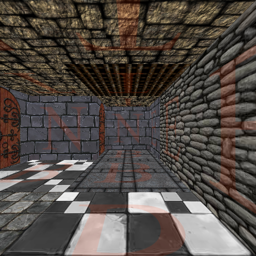

# Dungeon-Crawler


## Project Description
Old School 3D Dungeon Crawler proof-of-concept implemented in CSS and JavaScript.

Live Demo: https://dungeon.iskarion.ddns.net/



## Install / Deploy Instructions
 1. Clone Repository
    ```bash
    git clone git@github.com:pinakure/Dungeon-Crawler.git /src/dungeon
    ```
 2. Get up the container
    ```bash
    cd /src/dungeon
    docker compose up --build -d
    ```
    